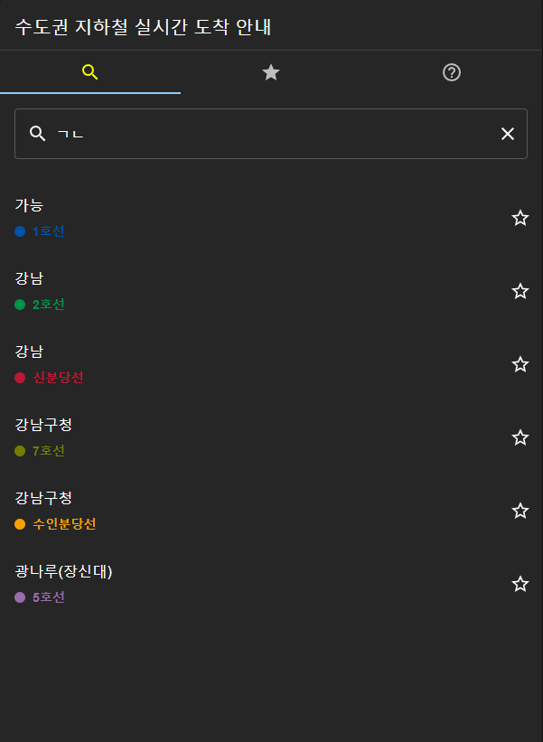
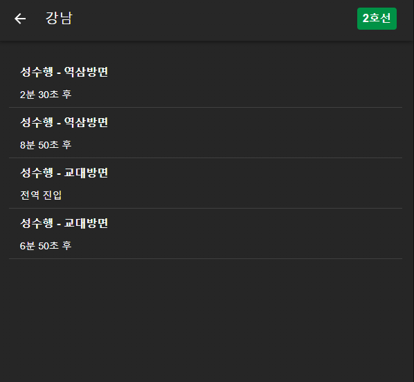
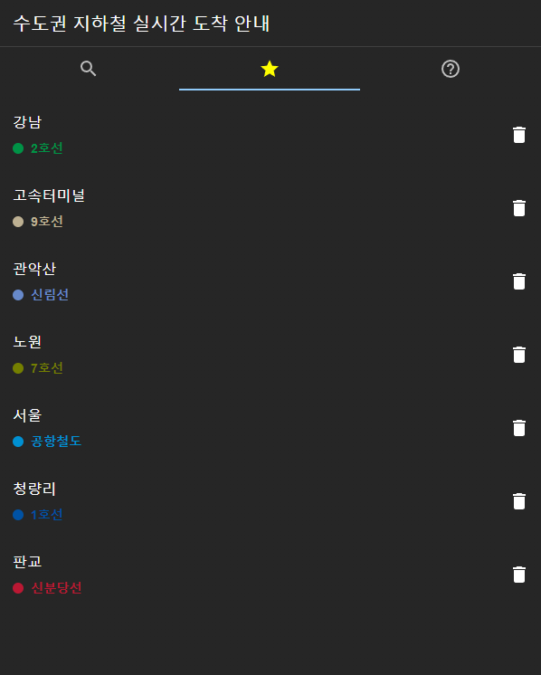

# 복슬지하철

실시간 수도권 지하철 도착시간 안내

참고: [앱 버전](https://github.com/setvect/BokslSubway) - flutter로 개발했음

## 1. 주요 기능

- 수도권 실시간 지하철 도착안내
  - 지원 노선: 1호선, 2호선, 3호선, 4호선, 5호선, 6호선, 7호선, 8호선, 9호선, 중앙선, 경의선, 공항철도, 경춘선, 수인분당선, 신분당선, 우이신설경전철, 서해선, 경강선
- 역 검색(초성검색)
- 즐겨찾기

## 2. 실행 및 빌드

### 2.1. 초기 셋팅

```shell
$ npm install
```

### 2.2. 실행 방법

- 프론트만 실행

```shell
$ npm run start
```

- 프론트와 netlify 함수 모두 실행

```shell
$ npm run dev
```

### 2.3. 빌드 방법

```shell
$ npm run build
```

- 빌드 결과는 /build 폴더에 생성됨

### 2.4. 빌드 결과 실행

```shell
$ npm install -g serve # 최초 1번만 실행
$ serve -s build
```

실행중에 아래 오류가 발생하면

```
serve -s build
serve : 이 시스템에서 스크립트를 실행할 수 없으므로 C:\Users\{사용자}\AppData\Roaming\npm\serve.ps1 파일을 로드할 수 없습니다. 자세한 내용은 about_Execution_Policies(https://go.microsoft.com/fwlink/?LinkID=135170)를 참조하십시오.
위치 줄:1 문자:1
+ serve -s build
+ ~~~~~
    + CategoryInfo          : 보안 오류: (:) [], PSSecurityException
    + FullyQualifiedErrorId : UnauthorizedAccess
```

PowerShell을 관리자 모드로 실행

```
Set-ExecutionPolicy -ExecutionPolicy RemoteSigned -Scope CurrentUser
serve -s build
```

## 3. 주요화면







## 4. 관련 정보

### 4.1. 공공 API

- [서울시 지하철 실시간 도착정보](https://data.seoul.go.kr/dataList/OA-12764/F/1/datasetView.do)
- [서울시 지하철역 정보 검색 (역명)](https://data.seoul.go.kr/dataList/OA-121/S/1/datasetView.do)
